# Architecture

## 1. Problem Statement

*Describe the fragmented customer identity problem across KIC's systems and why it matters. Why is a shared email or phone number insufficient as a single canonical key? What are the business consequences of unresolved identity — in CRM, in marketing attribution, in the studio experience?*

---

The fragmented customer identity problem across KIC's systems is a common problem that stems from the fact KIC uses a number of 3rd party systems to offer services and products to its members. Each of those systems can require a different integration pattern (webhooks, polling, SDK instrumentation, etc), and more importantly each system potentially provides different signals with different levels of confidence about which customer they ultimately belong to.

Shared email or phone numbers are insufficient as a single canonical key. Some people have multiple emails. People switch phone numbers or disconnect prepaid SIMs. Additionally customers may enter fake or mistyped email addresses/phone numbers during signup

From a business perspective the result of not having a single canonical key for a customer may include:
* distorted understanding of customers through incorrect analytics - if 20% of your customers appear as two records, your cohort analysis is wrong. Churn rates, LTV calculations, acquisition attribution — all distorted.
* duplicate messaging to a customer, resulting in them unsubscribing or cancelling services, or alternatively using a discount offer they had already previously received.
* lost cross-sell opportunities -  if the Shopify system doesn't know Jane is a studio regular, you can't cross-sell her studio-relevant products (e.g. resistance bands).
* no complete picture of a member's activity - a front desk person pulls up a member at studio check-in and sees no purchase history, previous bookings, or engagement history

## 2. Build vs Buy

*Would you build this identity resolution layer, or buy a Customer Data Platform (CDP) — and why? What factors drive that call: cost, control, time-to-value, team capability, data residency, or something else? If you'd buy, which product and why; if you'd build, what does that imply about ongoing maintenance and ownership?*

---

Before I made any decision regarding build vs buy, I would want to answer a few questions:
* what SaaS products exist that would be suitable (e.g. Segment, Rudderstack, mParticle). what features do they provide? what native connectors do they provide?
* what event volume do we expect now? and at what rate do we expect the event volume to grow?
* what are the licensing costs based on the expected event volume?
* what existing contracts are in place with SaaS providers?
* what 3rd party systems may need to be integrated in the future?
* what are the estimated implementation costs for build vs buy? and time-to-value estimates?

Having said that, I would lean towards building the identity resolution layer for the following reasons:
* **cost** - licensing costs can be very expensive for SaaS products (e.g. Segment charges by event volume)
* **control** - the core identity logic is business-critical and specific to KIC. The rules around merges, conflicts, confidence and reversibility need to be transparent and auditable.
* **team capability** - KIC has a small focused team that has the capacity and knowledge to implement a custom platform
* **data residency** - KIC Wellness is an Australian company and keeping the data residency within Australia is desirable rather than outsourcing to an international SaaS.

The tradeoffs would be:
* **time-to-value** - building the core logic and connectors would potentially take longer than buying an existing SaaS solution
* **ongoing maintenance** - KIC must own ongoing maintenance, monitoring, schema governance, manual merging and incident handling

## 3. Proposed Data Model

*Define the unified customer profile and how it relates to identity signals and source events. A diagram or structured description is fine. Consider: what is the canonical record, how are signals stored as typed edges, and how do source events reference the profile rather than the signal?*

---

## 4. Integration Points

*For each of KICApp, Shopify, Mindbody — how does data flow into the central layer? What signals does each system provide, and what are the integration patterns (webhooks, polling, SDK instrumentation, server-side event forwarding)?*

---

**Shopify** - webhooks - Shopify pushes orders/created, customers/created, etc. to the POST endpoint. The signals it provides are shopify_customer_id, email, phone, and device_id

**Mindbody** - webhooks - Signals are mindbody_client_id, client_email, phone and device_id

**KICApp** - since KIC owns it there are different options available: server-side event forwarding, SDK/client instrumentation, webhooks, polling. I'd recommend both service-side event forwarding and SDK/client instrumentation, to capture as many signals as possible. Signals are app_user_id, email, phone and device_id.

## 5. Identity Resolution

*How does the system resolve events to canonical profiles when no single shared key exists?*

Cover:
- The resolution algorithm: given an incoming event with a set of signals, how do you find the right profile? What is the lookup order? What happens when signals match different profiles (collision)?
- Deterministic vs probabilistic signals: how does your model distinguish between a high-confidence match (same phone) and a lower-confidence one (same device, which could be a shared iPad at a studio)?
- Cascading merges: when a new event links two previously separate profiles, how do you unify them? What happens to their existing events?
- Merge provenance: what do you record about why two profiles were merged, so the decision can be reviewed or reversed?
- The real KIC signal landscape includes: `email`, `phone`, `device_id`, `browser_fingerprint`, `shopify_customer_id`, `mindbody_client_id`, `app_user_id`, `fbclid`, `gclid`. How does your model accommodate signals that are short-lived (click IDs) versus stable (platform IDs)?

---

* We find the right profile by systematically searching for profiles based on signal strength/precedence
* The precedence/lookup order is platform IDs first, phone number second, email address third, and device ID last.
* At the moment my solution handles collisions by short circuiting, i.e. the higher signal strenth/precedence wins out. Given more time I would match on both and build a UI around it for someone to manually review the matches.
* Deterministic vs probabilistic signals - we store the confidence in the IdentitySignal model to differentiate between deterministic and probabilistic matches
* When a new event links two previously separate profiles we unify them by creating a MergeRecord and merging the customers together, copying across their existing events. The absorbed customer is soft deleted by setting the mergedIntoId/mergedInto field, and importantly the events remain connected in case a merge reversal is required. Finally, we do a sweep to check if any cascading merges are required.
* When two profiles are merged we create a MergeRecord with the fields: id, canonicalId/canonical, absorbedId/absorbed (customer absorbed by the merge/soft deleted), signals (that triggered the merge), confidence, createdAt. We also copy the events and signals from the absorbed customer to the canonical customer - this allows easy rollback if a merge needs to be reversed.
* The model accommodates signals that are short lived by storing the expiresAt field on the IdentitySignal model that way they can be filtered out when they expire

## 6. Failure Modes

*Identify at least four failure scenarios and how the architecture mitigates each. Consider: duplicate webhooks, downstream outages, schema drift in source payloads, identity conflicts (two real people sharing a device), a bad merge that incorrectly unified two separate customers, and what happens when it goes out against a stale identity snapshot.*

---

**Duplicate webhooks** - Shopify or Mindbody may send the same event more than once. To mitigate that we can store the source system and source event ID. Then when a new webhook payload arrives we can check if it has already been received before processing, making it idempotent.

**Downstream outages** - CRM, marketing automation or other downstream services may be temporarily unavailable. To mitigate that we can use event queues which would enable retries (with exponential backoff), and dead-letter queues to store failed delivery attempts for manual investigation.

**Schema drift** - source systems may change payload structure. To allow for this scenario we should use schema validation at ingestion, version source adapters and store raw payloads for replay purposes. Additionally we should send alerts (to something like Sentry) when fields are missing or malformed.

**Identity conflicts** - two real people may share a device, phone number or browser. Therefore, we should not merge on weaker (probablistic) signals alone. We should only automatically merge on stable or verified identifiers and flag conflicting strong signals and weaker signals for manual review.

**Bad merge** - two separate people may be incorrectly merged. To deal with this scenario we should maintain merge provenance and support merge reversal.

## 7. Rollout Strategy

*How would you introduce this without breaking existing integrations? Consider shadow mode, feature flags, phased cutover, and how you'd validate identity resolution accuracy before making it load-bearing for CRM or marketing sends.*

---

1. Start with shadow mode - wire up the webhooks so the identity layer receives and processes events, builds profiles and merges records - but nothing downstream reads from it yet.
2. Validation - over the next four weeks of shadow mode we will get enough data to see how many profiles are merged, and if they look correct by sampling merged profiles manually.
3. Feature flags for phased cutover — rather than a hard switch, gate each downstream consumer behind a flag and slowly turn them on as confidence grows (starting with marketing sends, and then the CRM).

The rollback capability allows the bad merges to be reversed without data loss, and the feature flags allow the downstream consumers to be switched off is trouble occurs.

## 8. "We Miss You" Campaign — Worked Example

*Trace this specific use case end-to-end through your proposed architecture: Marketing wants to send a re-engagement email to members who have lapsed from studio bookings but remain active in the app, with a discount code valid in both Shopify and at the studio.*

*Walk through: how the system knows these are the same person (they may have different emails in Mindbody vs the app), how the lapse signal is detected, how the discount code is issued and made valid across both systems, and what happens if the identity resolution was wrong — the wrong person gets the email or the discount is redeemed by someone else.*

Step 1 — Knowing they're the same person

Lets say Jane has jane@mindbody.com in Mindbody and jane@app.com in KICApp — different emails. But her phone +61412345678 is in both. When the Mindbody booking webhook arrived, it stored mindbody_client_id + client_email + phone. When
KICApp forwarded her activity, it brought app_user_id + app_email + phone. The phone was the linking signal — resolveIdentity merged them into one canonical profile. The canonical now carries all signals from both systems.

Step 2 — Detecting the lapse

"Lapsed from studio bookings but still active in the app" is a query against the unified event timeline: find canonical customers whose most recent Event with source: "mindbody" is older than 30 days, AND who have a recent
Event from KICApp. This query is only possible because both event streams are attached to the same canonical customer. Without the identity layer, you'd have no reliable way to join Mindbody's last-booking date with the app's
last-activity date.

Step 3 — Issuing the discount

The canonical profile includes both shopify_customer_id and mindbody_client_id as signals. So you can issue:
- A Shopify discount code scoped to that shopify_customer_id — valid online
- A Mindbody promo tied to that mindbody_client_id — valid at the studio
